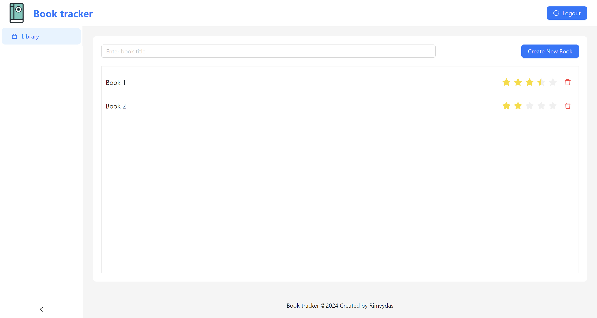
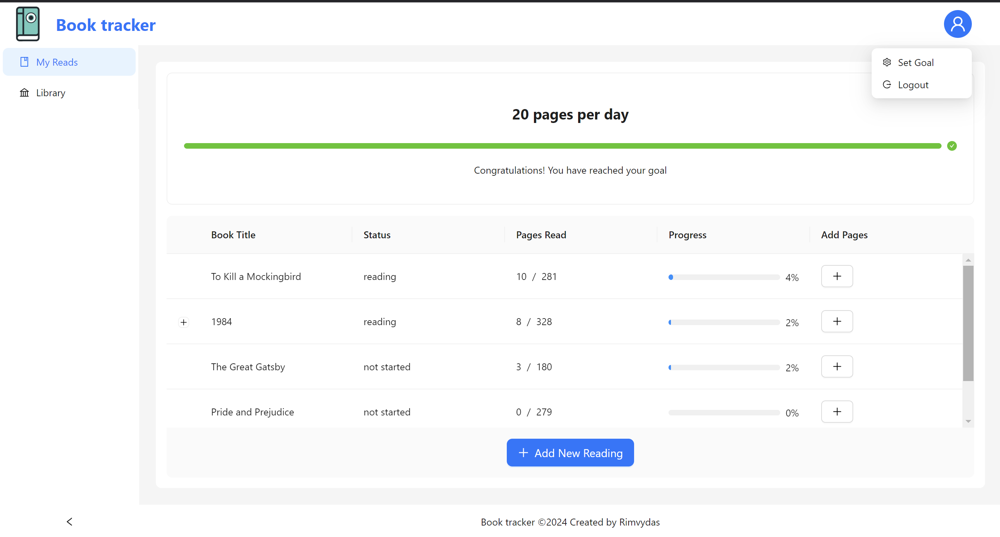
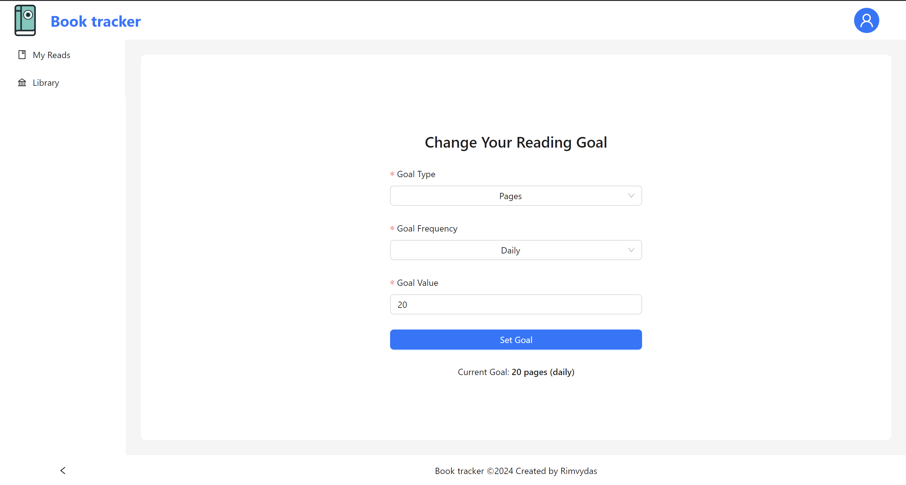

# book-tracker

## Project Overview
The Book Tracking System is a web application where users can log their reading activities, create personalized reading lists, add notes to books, and track their reading progress. This project is designed to enhance reading management and encourage literature consumption by making it easy for users to monitor their reading habits.

### Features

#### Sprint 1:
- [x] User registration and login.
- [x] Adding books to the system.

#### Sprint 2:
- [x] Tracking reading progress in terms of pages read.
- [x] Book rating feature.
- [x] Setting daily or monthly reading goals.

#### Sprint 3:
- [ ] Adding notes to book pages (e.g., favorite quotes or reflections).
- [x] Managing a list of books to read.

#### Sprint 4:
- [ ] Visualization of daily reading statistics.
- [ ] Exporting lists (e.g., books to read or favorite books).

## Technologies Used
- Frontend: React (with lazy loading for efficient route management)
- Backend: Go (for high performance and efficient data processing)
- Database: MariaDB (chosen for its reliability and ability to handle complex queries)
- Authentication: OAuth (Google) for a quick, secure sign-in process
- Authorization: JWT (to secure access to routes and resources)

## Run project
- Run `docker compose up --build`
- navigate to `http://localhost:80`
